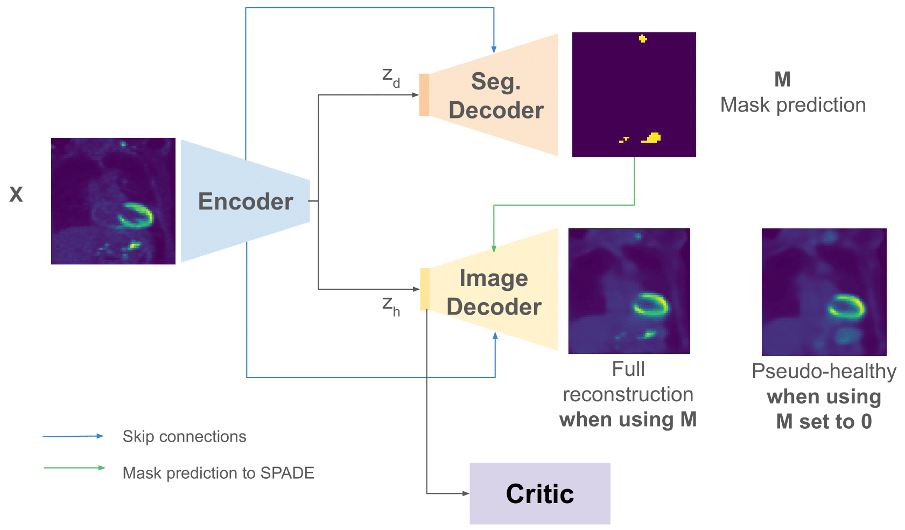

# PET-Disentangler
This repository contains the official implementation for PET-Disentangler, as seen in the paper [Disentangled PET Lesion Segmentation](https://arxiv.org/abs/2411.01758), that approaches lesion segmentation using an image disentanglement framework. 

## Abstract
PET imaging is an invaluable tool in clinical settings as it captures the functional activity of both healthy anatomy and cancerous lesions. Developing automatic lesion segmentation methods for PET images is crucial since manual lesion segmentation is laborious and prone to inter- and intra-observer variability. We propose PET-Disentangler, a 3D disentanglement method that uses a 3D UNet-like encoder-decoder architecture to disentangle disease and normal healthy anatomical features with losses for segmentation, reconstruction, and healthy component plausibility. A critic network is used to encourage the healthy latent features to match the distribution of healthy samples and thus encourages these features to not contain any lesion-related features. Our quantitative results show that PET-Disentangler is less prone to incorrectly declaring healthy and high tracer uptake regions as cancerous lesions, since such uptake pattern would be assigned to the disentangled healthy component.


## Installation
```bash
git clone https://github.com/tgatsak/PET-Disentangler.git
cd PET-Disentangler/
# Create a python virtual environment or conda environment, then install the required packages:
pip install -r requirements.txt 
```
## Dataset
The data used for this work is from the [TCIA whole-body FDG-PET/CT dataset](https://www.cancerimagingarchive.net/collection/fdg-pet-ct-lesions/), and also appears in the [autoPET challenges](https://autopet.grand-challenge.org/). For this work, we used the autoPET 2022 dataset in which the processed PET SUV, CT, and segmentation data can be downloaded and extracted using the following commands:

```bash
# Create a dataset directory:
mkdir dataset
# Within the dataset directory, download the TCIA dataset and extract:
scp http://data.midaslab.org/autoPET/data/nifti.zip dataset/
unzip -q dataset/nifti.zip
```

The dataset is publically available on TCIA in DICOM format with scripts to convert the files to NIfTI format available [here](https://github.com/lab-midas/TCIA_processing).

## Preprocessing
The preprocessing steps in this work include: 
- leveraging TotalSegmentator to obtain organ segmentations for each study,
- identifying upper torso and lower torso field-of-views (FOV) based on aorta and bladder coordinates, respectively,
- determining whether these FOVs are healthy or contain disease, and
- obtaining the upper and lower torso crops for each study.

All of these steps are performed in the preprocessing.py file which expects the FDG-PET-CT-Lesions dataset directory to be within the dataset directory. The preprocessing can be performed using the following command:

```bash
python src/preprocessing.py
```

## Training
Within the `experiments` directory are three files that run the experiments for the SNMMI, upper torso, and lower torso experiments, along with the final hyperparameters. The training files include:
- `training_SNMMI_baseline_segmentationonly.py`: trains the baseline segmentation model for SNMMI upper torso experiment on a subset of the TCIA Whole-body FDG-PET/CT dataset.
- `training_SNMMI_petdisentangler.py`: trains PET-Disentangler variants (i.e., full-skip, no-skip, optimal) for SNMMI upper torso experiment on a subset of the TCIA Whole-body FDG-PET/CT dataset.
- `training_fulldataset_uppertorso_ablation.py`: trains ablation experiments on upper torso data from full dataset of TCIA Whole-body FDG PET/CT dataset. 
- `training_fulldataset_uppertorso_petdisentangler.py`: trains PET-Disentangler on upper torso data from full dataset of TCIA Whole-body FDG PET/CT dataset. 
- `training_fulldataset_lowertorso_ablation.py`: trains ablations experiments on lower torso data from full dataset. 
- `training_fulldataset_lowertorso_petdisentangler.py`: trains PET-Disentangler on lower torso data from full dataset 

## Citation
If you find this work or implementation useful, please cite our paper: 
```
@misc{gatsak2024disentangledpetlesionsegmentation,
      title={Disentangled PET Lesion Segmentation}, 
      author={Tanya Gatsak and Kumar Abhishek and Hanene Ben Yedder and Saeid Asgari Taghanaki and Ghassan Hamarneh},
      year={2024},
      eprint={2411.01758},
      archivePrefix={arXiv},
      primaryClass={eess.IV},
      url={https://arxiv.org/abs/2411.01758}, 
}
```
--- 

If there are any issues regarding the repository or any suggestions, please raise an issue. 
